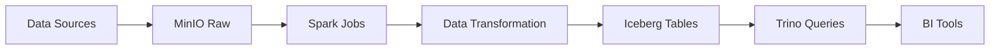

# 🏗️ Architecture de la Data Platform

## Vue d'ensemble

La plateforme de données est déployée sur un cluster Kubernetes auto-hébergé sur Proxmox.

## 🖥️ Infrastructure

### Cluster Kubernetes

```
┌─────────────────────────────────────────┐
│         Proxmox Host Server             │
│  • CPU: Compatible x86-64-v1            │
│  • RAM: 128 GB                          │
│  • Stockage: 1 To                       │
└─────────────────────────────────────────┘
                  │
    ┌─────────────┴─────────────┐
    │                           │
┌───▼────────┐          ┌───────▼────┐
│  Masters   │          │  Workers   │
│  (3 VMs)   │          │  (7 VMs)   │
│            │          │            │
│ • Control  │          │ • Workload │
│   Plane    │          │   Pods     │
└────────────┘          └────────────┘
```

### Machines Virtuelles

| Type | Nombre | vCPU | RAM | Stockage | Rôle |
|------|--------|------|-----|----------|------|
| Master | 3 | 4 | 8 GB | 100 GB | Control plane, etcd |
| Worker | 7 | 8 | 16 GB | 200 GB | Workloads, data processing |

## 📊 Stack Applicatif

### Couche Stockage

```
┌─────────────────────────────────────────┐
│            MinIO (S3)                   │
│  • Object Storage                       │
│  • Buckets: warehouse, datalake         │
│  • Backend pour Iceberg                 │
└─────────────────────────────────────────┘
```

### Couche Compute

```
┌─────────────────────────────────────────┐
│         Spark Operator                  │
│  • Spark 3.5.0                          │
│  • PySpark jobs                         │
│  • Iceberg integration                  │
└─────────────────────────────────────────┘
                  +
┌─────────────────────────────────────────┐
│            Trino 469                    │
│  • SQL queries                          │
│  • Multi-source federation              │
│  • Iceberg catalog                      │
└─────────────────────────────────────────┘
```

### Couche Sécurité

```
┌─────────────────────────────────────────┐
│        HashiCorp Vault                  │
│  • Secrets management                   │
│  • API keys storage                     │
│  • Credentials rotation                 │
└─────────────────────────────────────────┘
```

### Couche Support

```
┌─────────────────────────────────────────┐
│      Docker Registry                    │
│  • Private images                       │
│  • Custom Spark images                  │
└─────────────────────────────────────────┘
                  +
┌─────────────────────────────────────────┐
│         Headlamp UI                     │
│  • K8s management                       │
│  • Logs & metrics                       │
└─────────────────────────────────────────┘
```

## 🔄 Flux de Données

### Pipeline Type: Ingestion → Processing → Storage



### Exemple Concret

```
1. Ingestion
   └─> API externe (CoinGecko, etc.)
       └─> Upload vers MinIO bucket "datalake"

2. Processing
   └─> Spark job lit depuis MinIO
       └─> Transformations (filter, aggregate, join)
       └─> Écrit vers Iceberg table dans "warehouse"

3. Query
   └─> Trino connecté au catalog Iceberg
       └─> SQL queries sur les tables
       └─> Export vers BI tools (Superset)
```

## 🌐 Réseau

### Architecture Réseau

```
Internet
    │
    ▼
[Proxmox Host: 135.181.211.227]
    │
    ▼
[Internal Network: 10.10.0.0/24]
    │
    ├─> 10.10.0.101 (Node 1)
    ├─> 10.10.0.102 (Node 2)
    └─> ...
```

### Accès Externe

Tous les services sont exposés via **NodePort** sur le réseau interne.

Accès depuis l'extérieur via **tunnels SSH** :

```bash
ssh -N -L 8080:10.10.0.101:30098 root@135.181.211.227
```

| Service | NodePort | Tunnel Local |
|---------|----------|--------------|
| Headlamp | 30098 | 8080 |
| MinIO Console | 30901 | 9001 |
| MinIO API | 30900 | 9000 |
| Vault UI | 30820 | 8200 |
| Docker Registry | 30500 | 5050 |

## 🔒 Sécurité

### Actuel (Dev Mode)

- ✅ Réseau interne isolé (10.10.0.0/24)
- ✅ Accès SSH par clé uniquement
- ⚠️ Pas de TLS/HTTPS
- ⚠️ Credentials par défaut
- ⚠️ NodePort exposés

### Production (TODO)

- [ ] TLS/HTTPS sur tous les services
- [ ] Network Policies Kubernetes
- [ ] Ingress controller avec certificats
- [ ] Vault en mode HA avec auto-unseal
- [ ] RBAC strict par namespace
- [ ] Pod Security Standards
- [ ] Secrets externes (External Secrets Operator)

## 📈 Scalabilité

### Actuel

- **Spark**: Scale horizontal via replicas d'executors
- **Trino**: 1 coordinator + 3 workers (peut scaler)
- **MinIO**: Mode standalone (1 instance)

### Évolution

Pour production :

```yaml
# MinIO Distributed Mode
replicas: 4  # Minimum pour HA
mode: distributed

# Trino Workers
replicas: 10  # Plus de workers = plus de parallélisme

# Spark Executors
executor:
  instances: 20  # Ajustable par job
```

## 💾 Stockage

### Classes de Stockage

```bash
kubectl get storageclass

NAME                 PROVISIONER
local-path (default) rancher.io/local-path
longhorn             driver.longhorn.io
```

### Utilisation

| Service | Storage | Type | Taille |
|---------|---------|------|--------|
| MinIO | PVC | longhorn | 500 GB |
| Vault | PVC | longhorn | 10 GB |
| Registry | PVC | longhorn | 100 GB |
| Iceberg Warehouse | S3 (MinIO) | Object | ~500 GB |

## 🔧 Monitoring (Futur)

### Stack Recommandé

```
Prometheus + Grafana
├── Metrics Kubernetes (kube-state-metrics)
├── Metrics Spark (Spark metrics exporter)
├── Metrics MinIO (built-in Prometheus endpoint)
└── Metrics Trino (JMX exporter)
```

### Alerting

- CPU/RAM usage > 80%
- Disk space < 20%
- Pod restarts > 3
- Spark job failures

## 📚 Références

- **Kubernetes**: https://kubernetes.io/
- **Proxmox**: https://www.proxmox.com/
- **Kubespray**: https://kubespray.io/
- **Apache Iceberg**: https://iceberg.apache.org/
- **Spark on K8s**: https://spark.apache.org/docs/latest/running-on-kubernetes.html

---

**Dernière mise à jour**: 2025-11-21
